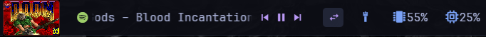
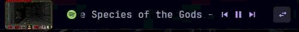

# Zebar DOOM Widget

Play DOOM (1993) inside your [Zebar](https://github.com/glzr-io/zebar) bar. The widget runs the actual game via [js-dos](https://js-dos.com/) (a WebAssembly DOSBox emulator) — showing attract mode demos in a tiny 64x40 bar preview, then expanding to 640x400 on click for full gameplay.

Windows 10/11 only. Requires Zebar v3.0+.






## How It Works

The widget has two states:

- **Compact (bar mode)** — 64x40 window embedded in your bar. The DOSBox canvas is CSS-scaled down to fit. DOOM runs its attract mode loop (title screen + demo playback) automatically. Click anywhere to expand.
- **Expanded (play mode)** — Window resizes to 640x400. The canvas fills the window at native resolution. Full keyboard/mouse input goes to the game. Click the X button to collapse back.

**Auto-flip:** If the widget is near the bottom of the screen, it expands upward instead of downward.

## Setup

### 1. Create the `doom.jsdos` bundle

You need the DOOM shareware files (`DOOM.EXE` and `DOOM1.WAD`). The shareware WAD is [freely distributable](https://doomwiki.org/wiki/DOOM1.WAD) (~4MB).

**Download** from [Internet Archive](https://archive.org/details/DoomsharewareEpisode) — grab `DoomV1.9sw1995idSoftwareInc.action.zip` and extract `DOOM.EXE` + `DOOM1.WAD`.

**Create the bundle** — a flat ZIP with both files at the root:

```bash
zip doom.jsdos DOOM.EXE DOOM1.WAD
```

On Windows (PowerShell):
```powershell
Compress-Archive -Path DOOM.EXE, DOOM1.WAD -DestinationPath doom.jsdos.zip
Rename-Item doom.jsdos.zip doom.jsdos
```

Place `doom.jsdos` in this directory alongside `doom.html`.

### 2. Install the widget

Copy the widget folder to your Zebar config directory:

```bash
cp -r ~/projects/zebar-doom-widget ~/.glzr/zebar/doom-widget
```

> **Important:** The folder name must be `doom-widget` to match the `name` field in `zpack.json`.

### 3. Add to Zebar startup

Edit `~/.glzr/zebar/settings.json` and add the widget to `startupConfigs`:

```json
{
  "startupConfigs": [
    { "pack": "doom-widget", "widget": "doom", "preset": "bar" }
  ]
}
```

Adjust `offsetX` / `offsetY` in `zpack.json` to position the widget where you want it on the bar.

### 4. Restart Zebar

The widget will appear as a tiny window showing DOOM's attract mode. Click to expand and play.

## Controls

| Action | Input |
|--------|-------|
| Expand to play mode | Click the compact preview |
| Collapse back to bar | Click the **X** button (top-right) |
| Collapse back to bar | Press **F9** |
| All DOOM controls | Work normally in expanded mode |

> **Note:** DOSBox captures most keyboard input in expanded mode. F9 is used as the collapse key because Escape is used by DOOM's own menu system.

## Presets

| Preset | Size | Use case |
|--------|------|----------|
| `bar` | 64x40 | Tiny bar embed — click to expand |
| `standalone` | 640x400 | Always-expanded game window |

## Custom WADs

You can swap in different WADs to play other DOOM content. Rebuild the `doom.jsdos` bundle with your WAD of choice:

### DOOM (registered full version)

If you own the full version, replace `DOOM1.WAD` with `DOOM.WAD`:

```bash
zip doom.jsdos DOOM.EXE DOOM.WAD
```

### DOOM II

DOOM II uses a different executable and WAD. You'll need `DOOM2.EXE` and `DOOM2.WAD` from your copy:

```bash
zip doom.jsdos DOOM2.EXE DOOM2.WAD
```

Then update the `-c` command in `doom.html` to match:

```js
main(['-c', 'DOOM2.EXE']).then(function(ci) {
```

### Freedoom

[Freedoom](https://freedoom.github.io/) is a free, open-source replacement WAD. Download `freedoom1.wad` (DOOM 1 compatible) or `freedoom2.wad` (DOOM 2 compatible), rename it to the expected filename, and bundle it:

```bash
# Freedoom Phase 1 (uses DOOM.EXE)
mv freedoom1.wad DOOM1.WAD
zip doom.jsdos DOOM.EXE DOOM1.WAD

# Freedoom Phase 2 (uses DOOM2.EXE)
mv freedoom2.wad DOOM2.WAD
zip doom.jsdos DOOM2.EXE DOOM2.WAD
```

### Important notes

- DOOM expects specific WAD filenames — `DOOM1.WAD` for shareware, `DOOM.WAD` for registered, `DOOM2.WAD` for DOOM II. Rename your WAD to match.
- The executable must match the WAD type — `DOOM.EXE` for DOOM 1 WADs, `DOOM2.EXE` for DOOM 2 WADs.
- Custom PWADs (mod WADs like Scythe, Eviternity, etc.) can be loaded by adding them to the ZIP and passing `-file MODNAME.WAD` as an extra `-c` arg in `doom.html`.

## Architecture

- **`doom.html`** — All widget logic. Uses [js-dos 6.22](https://js-dos.com/6.22/current/js-dos.js) for the DOSBox emulator (loaded from CDN) and Tauri APIs from [esm.sh](https://esm.sh/) for window management.
- **`styles.css`** — Styling for compact/expanded states, canvas scaling, and the collapse button.
- **`doom.jsdos`** — DOOM shareware bundle (user-supplied). A ZIP containing `DOOM.EXE` and `DOOM1.WAD`.
- **`zpack.json`** — Zebar widget package definition with presets and window properties.

### Key implementation details

- **Dynamic window resizing** uses the same pattern as [zebar-app-launcher](https://github.com/johnsideserf/zebar-app-launcher) — Tauri's `LogicalSize`/`LogicalPosition` APIs resize the OS window between compact and expanded states.
- **Canvas scaling** in compact mode uses `CSS transform: scale()` computed dynamically from the canvas native resolution (320x200) vs the window size.
- **No build step.** Everything loads from CDN. Edit files and restart Zebar to see changes.
- **No shell privileges needed.** js-dos runs entirely in WebAssembly.
